# PROMETHEUS Architecture Diagrams

## System Architecture

```mermaid
graph TB
    subgraph "Local Nexus 🖥️"
        CLI[vertice CLI<br/>Rust-style Python]
        TUI[Textual TUI<br/>Matrix Style]
        Gradio[Gradio Dashboard<br/>Cyberpunk UI]
    end

    subgraph "Protocol Layer 🔌"
        MCP[Model Context Protocol<br/>File/Git/Terminal Access]
    end

    subgraph "Remote Cortex (Blaxel) ☁️"
        Gemini[Gemini 3 Pro<br/>2M Context Window]
        MIRIX[(MIRIX Memory<br/>6 Types)]
        SimuRA[SimuRA World Model<br/>MCTS Simulation]
        Agent0[Agent0 Evolution<br/>Co-Evolution Loop]
    end

    CLI --> MCP
    TUI --> MCP
    Gradio --> MCP
    MCP --> Gemini
    Gemini --> MIRIX
    Gemini --> SimuRA
    Gemini --> Agent0

    MIRIX -->|Episodic| Gemini
    MIRIX -->|Procedural| Gemini
    SimuRA -->|Predicted States| Gemini
    Agent0 -->|Improved Tools| Gemini

    style Gemini fill:#4285F4,stroke:#1967D2,color:#fff
    style MIRIX fill:#34A853,stroke:#188038,color:#fff
    style SimuRA fill:#FBBC04,stroke:#F9AB00,color:#000
    style Agent0 fill:#EA4335,stroke:#C5221F,color:#fff
    style MCP fill:#9AA0A6,stroke:#5F6368,color:#fff
```

## MCP Communication Flow

## Agent0 Co-Evolution Loop

## MIRIX Memory System

## SimuRA World Model (MCTS)

## Tool Execution Pipeline

---

## Diagram Usage

To embed these diagrams in the README, use:

\`\`\`markdown

\`\`\`

Or for GitHub, the Mermaid will render automatically if included in the README directly.
