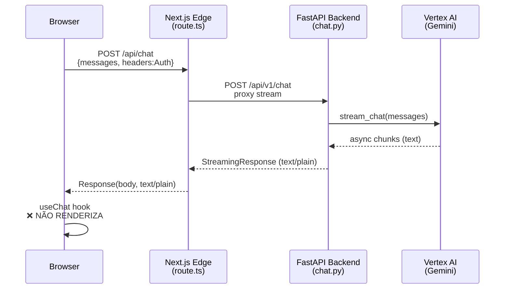

# RELATÓRIO DE FALHA CRÔNICA: Chat Streaming Não Renderiza
**Projeto:** Vertice Chat Web Application
**Data:** 2026-01-10
**Severidade:** CRÍTICA
**Status:** NÃO RESOLVIDO

---

## 1. RESUMO EXECUTIVO

O chat do Vertice não exibe respostas do Gemini, apesar de:
- ✅ Autenticação Firebase funcionando (401 corrigido)
- ✅ Backend retornando HTTP 200 com dados (655 bytes)
- ✅ Vertex AI respondendo corretamente
- ❌ **Frontend não renderiza o texto recebido**

### 1.1 DESCRIÇÃO VISUAL DO PROBLEMA (Screenshot Analisado)

**Layout da Tela:**
A interface mostra a aplicação Vertice em tela dividida:
- **Lado Esquerdo (50%):** Interface de chat com fundo escuro (tema dark mode)
- **Lado Direito (50%):** Chrome DevTools aberto na aba "Console"

**Painel de Chat (Esquerda):**
- Header mostra "CONSOLE" com ícone "V" (logo Vertice) e subtítulo "SOVEREIGN V1.0"
- Botão "+ New Session" azul no topo
- Área central mostra "NO HISTORY" indicando sessão limpa
- **DUAS BOLHAS DE MENSAGEM AZUIS** no lado direito (mensagens do usuário):
  - Primeira bolha: "01" (texto enviado pelo usuário)
  - Segunda bolha: "01" (segunda tentativa de envio)
  - Ambas marcadas com "O AGEIA" (timestamp/label)
- **NENHUMA RESPOSTA DO AI APARECE** - espaço vazio onde deveria haver bolhas cinza/brancas do assistente
- Sidebar esquerda mostra "Documentation" e "Sovereign Control"
- Footer mostra avatar do usuário "JUAN C SOUZA" e versão "Vertice Sovereign AI - Phase 2.0"

**Console DevTools (Direita):**
- Múltiplas linhas de log com fundo amarelo/azul destacado
- Logs mostram ciclos repetitivos de:
  ```
  [DEBUG] ChatInterface Render Cycle Start
  [DEBUG] useChat hook result keys: (13) ['id', 'messages', 'setMessages', 'sendMessage', ...]
  ```
- **LOG CRÍTICO DESTACADO:**
  ```
  [DEBUG] Submitting with Headers: {Authorization: 'Bearer eyJhbGciOiJS...'}
  ```
  - Mostra o token JWT completo (1149 caracteres) sendo enviado
  - Token decodificado visível: `iss: securetoken.google.com/vertice-ai`, `aud: vertice-ai`
- Após submissão, aparece:
  ```
  [DEBUG] useChat Finish
  ```
  **OBSERVAÇÃO CRÍTICA:** O hook `useChat` dispara `onFinish` IMEDIATAMENTE após o submit, sem aguardar/renderizar os chunks de stream.

- Aba "Issues" mostra warning de acessibilidade (não relacionado):
  - "A form field element should have an id or name attribute"

**Conclusão Visual:**
O usuário enviou mensagens ("01") duas vezes. O token de autenticação está sendo enviado corretamente (visível no console). O hook `useChat` recebe os dados (HTTP 200) e dispara `onFinish`, mas **nenhuma mensagem de resposta do AI é adicionada ao array `messages`**. O array permanece apenas com as mensagens do usuário, resultando em bolhas vazias do lado do assistente.

---

## 2. ARQUITETURA DO FLUXO



---

## 3. EVIDÊNCIAS DE LOG

### 3.1 Backend Logs (Cloud Run - vertice-backend-00019-dx2)
```log
INFO:app.main:[Middleware] Processing POST /api/v1/chat
INFO:app.main:[Middleware] Auth Header Present. Length: 1149
INFO:app.main:[Middleware] Token Prefix Valid. Sample: Bearer eyJhbGci...
INFO:app.api.v1.chat:Authenticated request from user WRSFR5AzDvbXIjOeeUPkxBgC27I2
"POST /api/v1/chat HTTP/1.1" 200 OK  (responseSize: 655 bytes, latency: 7.9s)
```

### 3.2 Frontend Console Logs
```javascript
[DEBUG] Submitting with Headers: {Authorization: 'Bearer eyJhbG...'}
[DEBUG] useChat Finish  // Hook termina sem exibir conteúdo
[DEBUG] ChatInterface Render Cycle Start
```

**ANOMALIA:** `useChat` dispara `onFinish` mas `messages` não contém resposta do AI.

---

## 4. CÓDIGO ATUAL (Estado em 2026-01-10)

### 4.1 Backend: `chat.py` (FastAPI)
```python
# Endpoint: @router.post("")
# Montado em: /api/v1/chat

async def stream_generator(request: ChatRequest):
    # ... Vertex AI init ...
    response_stream = await chat.send_message_async(message, stream=True)

    async for chunk in response_stream:
        text_content = chunk.text
        if text_content:
            yield text_content  # << APENAS TEXTO RAW

return StreamingResponse(
    stream_generator(request),
    media_type="text/plain",
    headers={
        "X-Accel-Buffering": "no",
        "Cache-Control": "no-cache",
    }
)
```

### 4.2 Frontend API Route: `route.ts` (Next.js Edge)
```typescript
export const runtime = 'edge';

export async function POST(req: Request) {
    const response = await fetch(`${backendUrl}/api/v1/chat`, {
        method: 'POST',
        headers: { 'Authorization': authHeader },
        body: JSON.stringify({ messages, model: 'gemini-3.0-pro' }),
    });

    return new Response(response.body, {
        headers: {
            'Content-Type': 'text/plain; charset=utf-8', // << PLAIN TEXT
        }
    });
}
```

### 4.3 Frontend Hook: `chat-interface.tsx`
```typescript
const chat = useChat({
    api: '/api/chat',
    headers: headers,
    streamProtocol: 'text', // << TENTATIVA DE FIX
    onError: (error) => console.error(error),
    onFinish: () => console.log('Finish'),
});

const { messages, sendMessage } = chat;
// messages.map(...) << NÃO CONTÉM RESPOSTA DO AI
```

---

## 5. DOCUMENTAÇÃO OFICIAL (Vercel AI SDK v6 - Janeiro 2026)

> **FONTE:** https://ai-sdk.dev/docs/ai-sdk-ui/stream-protocol
> **Última atualização:** Janeiro 2026

### 5.1 Text Stream Protocol

> A text stream contains chunks in **plain text**, that are streamed to the
> frontend. Each chunk is then appended together to form a full text response.
>
> Text streams are supported by `useChat`, `useCompletion`, and `useObject`.
> When you use `useChat`, you need to enable text streaming by setting the
> `streamProtocol` option to `'text'`.

**Exemplo Oficial do Backend (Next.js):**
```typescript
import { streamText, UIMessage, convertToModelMessages } from 'ai';

export async function POST(req: Request) {
  const { messages }: { messages: UIMessage[] } = await req.json();

  const result = streamText({
    model: "anthropic/claude-sonnet-4.5",
    messages: await convertToModelMessages(messages),
  });

  return result.toTextStreamResponse();  // << MÉTODO NATIVO DO SDK
}
```

**Exemplo Oficial do Frontend:**
```typescript
import { useChat } from '@ai-sdk/react';
import { TextStreamChatTransport } from 'ai';

const { messages, sendMessage } = useChat({
  transport: new TextStreamChatTransport({ api: '/api/chat' }),
  // OU
  // api: '/api/chat',
  // streamProtocol: 'text',
});
```

### 5.2 Data Stream Protocol (Alternativa Mais Robusta)

> A data stream follows a special protocol that the AI SDK provides.
> Uses **Server-Sent Events (SSE)** format. When you provide data streams
> from a custom backend, you need to set the `x-vercel-ai-ui-message-stream`
> header to `v1`.

**Formato SSE Esperado:**
```
data: {"type":"start","messageId":"..."}

data: {"type":"text-start","id":"msg_12345"}

data: {"type":"text-delta","id":"msg_12345","delta":"Hello"}

data: {"type":"text-delta","id":"msg_12345","delta":" World"}

data: {"type":"text-end","id":"msg_12345"}

data: {"type":"finish-message","messageId":"...","finishReason":"stop"}
```

**Header Obrigatório:**
```
x-vercel-ai-ui-message-stream: v1
Content-Type: text/event-stream
```

---

## 6. DIAGNÓSTICO DO PROBLEMA

### Hipótese 1: `streamProtocol: 'text'` Requer `TextStreamChatTransport`
A documentação oficial mostra o uso de `TextStreamChatTransport` como `transport`, não apenas `streamProtocol`. Possível incompatibilidade de API.

### Hipótese 2: Formato de Resposta Incompatível
O Backend envia texto raw (`yield text_content`), mas:
- O SDK pode esperar newlines específicos
- O SDK pode esperar chunks terminados em `\n`
- O codec de streaming pode estar bufferizando

### Hipótese 3: Edge Runtime Bufferiza o Stream
O Next.js Edge Runtime pode não estar passando o stream corretamente. Cloud Run também pode ter buffering (apesar do header `X-Accel-Buffering: no`).

### Hipótese 4: `message.parts` vs `message.content`
A documentação v6 usa `message.parts[].text`, não `message.content`. O componente de renderização pode estar lendo o campo errado.

---

## 7. RECOMENDAÇÕES DE FIX

### Opção A: Usar `TextStreamChatTransport` (Nativo do SDK)

**Frontend (`chat-interface.tsx`):**
```typescript
import { useChat } from '@ai-sdk/react';
import { TextStreamChatTransport } from 'ai';

const { messages, sendMessage } = useChat({
  transport: new TextStreamChatTransport({ api: '/api/chat' }),
});

// Renderização:
messages.map(message => (
  message.parts?.map(part => {
    if (part.type === 'text') return <span>{part.text}</span>;
  })
))
```

### Opção B: Implementar Data Stream Protocol Completo

**Backend (`chat.py`):**
```python
import uuid

async def stream_generator_sse(request: ChatRequest):
    msg_id = str(uuid.uuid4())

    # Start Event
    yield f"data: {json.dumps({'type': 'start', 'messageId': msg_id})}\n\n"
    yield f"data: {json.dumps({'type': 'text-start', 'id': msg_id})}\n\n"

    response_stream = await chat.send_message_async(message, stream=True)
    async for chunk in response_stream:
        if chunk.text:
            yield f"data: {json.dumps({'type': 'text-delta', 'id': msg_id, 'delta': chunk.text})}\n\n"

    # End Events
    yield f"data: {json.dumps({'type': 'text-end', 'id': msg_id})}\n\n"
    yield f"data: {json.dumps({'type': 'finish-message', 'messageId': msg_id, 'finishReason': 'stop'})}\n\n"

return StreamingResponse(
    stream_generator_sse(request),
    media_type="text/event-stream",
    headers={
        "x-vercel-ai-ui-message-stream": "v1",
        "Cache-Control": "no-cache",
    }
)
```

**Frontend (`route.ts`):**
```typescript
return new Response(response.body, {
    headers: {
        'Content-Type': 'text/event-stream',
        'x-vercel-ai-ui-message-stream': 'v1',
    }
});
```

---

## 8. PASSOS PARA DEBUG LOCAL

```bash
# Terminal 1: Backend
cd vertice-chat-webapp/backend
pip install -r requirements.txt
export GOOGLE_CLOUD_PROJECT=vertice-ai
uvicorn app.main:app --reload --port 8000

# Terminal 2: Frontend
cd vertice-chat-webapp/frontend
pnpm install
echo "NEXT_PUBLIC_API_URL=http://localhost:8000" > .env.local
pnpm dev

# Terminal 3: Teste Manual do Stream
curl -N -X POST http://localhost:8000/api/v1/chat \
  -H "Authorization: Bearer dev-token" \
  -H "Content-Type: application/json" \
  -d '{"messages":[{"role":"user","content":"Hello"}]}'
```

**Verificar:**
1. Se o curl retorna texto incrementalmente ou tudo de uma vez
2. Se há newlines no output
3. O formato exato dos bytes retornados

---

## 9. ARQUIVOS RELEVANTES

| Arquivo | Caminho | Função |
|---------|---------|--------|
| Backend Endpoint | `backend/app/api/v1/chat.py` | Gera stream do Vertex AI |
| Frontend API Route | `frontend/app/api/chat/route.ts` | Proxy Edge para Backend |
| Chat Component | `frontend/components/chat/chat-interface.tsx` | Hook useChat + UI |
| Message Bubble | `frontend/components/chat/message-bubble.tsx` | Renderiza mensagens |

---

## 10. CONCLUSÃO

O problema está na **camada de parsing do stream** entre o Backend (FastAPI) e o hook `useChat` do Vercel AI SDK v6. As tentativas anteriores focaram em:
1. Corrigir autenticação (✅ resolvido)
2. Corrigir redirects (✅ resolvido)
3. Alinhar protocolo de stream (`streamProtocol: 'text'`) (❌ não funcionou)

**A solução mais provável** é implementar o **Data Stream Protocol completo** (Opção B) com SSE e os eventos `start/delta/end`, pois é o formato nativo esperado pelo SDK v6.

---

*Relatório gerado por Gemini em 2026-01-10T22:25:15-03:00*
