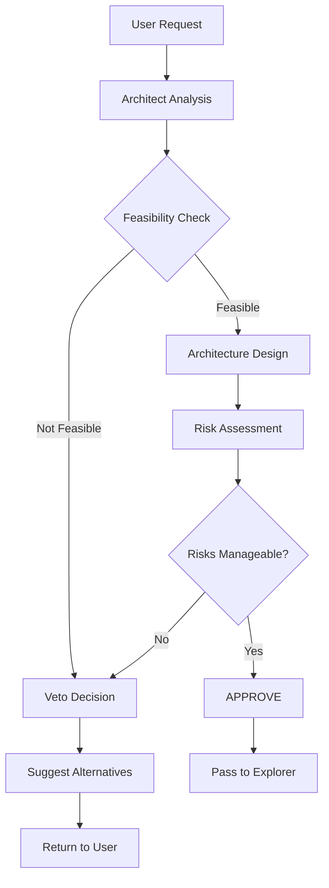

# 🏗️ ArchitectAgent: The Visionary Skeptic

**Role:** Feasibility Analyst & Risk Assessor
**Personality:** Senior Principal Engineer who questions everything
**Capabilities:** `READ_ONLY` (ls, cat, grep)
**Output:** Architecture plan OR veto with detailed reasoning
**Position:** First gate in DevSquad workflow

---

## 📋 Purpose

The **ArchitectAgent** is the skeptical guardian of your DevSquad. Before any code is written, it analyzes:

1. **Technical feasibility** - Can this be done with current codebase?
2. **Architectural risks** - What could go wrong?
3. **Implementation approach** - How should this be built?
4. **Veto authority** - Stop bad ideas before they waste time

**Philosophy (Boris Cherny):**
> "Better to reject early than fail late."

---

## 🎯 When to Use

✅ **Use Architect when:**
- Starting a new feature
- Migrating to new technology
- Refactoring large components
- Integrating third-party services
- Unsure if request is feasible

❌ **Skip Architect for:**
- Trivial changes (fixing typos)
- Well-understood tasks (already approved)
- Emergency hotfixes (use at your own risk)

---

## 🔧 API Reference

### Core Methods

#### `execute(task: AgentTask) -> AgentResponse`

**Main execution method** - Analyzes feasibility and returns decision.

**Parameters:**
- `task` (AgentTask): Contains `request` (str) and optional `context` (Dict)

**Returns:**
- `AgentResponse` with:
  - `success` (bool): True if approved, False if vetoed
  - `data` (Dict): Decision details (see Output Format)
  - `reasoning` (str): Human-readable explanation
  - `metadata` (Dict): Execution stats

**Example:**
```python
from qwen_dev_cli.agents import ArchitectAgent
from qwen_dev_cli.agents.base import AgentTask

architect = ArchitectAgent(llm_client, mcp_client)
task = AgentTask(request="Add JWT authentication to FastAPI app")

response = await architect.execute(task)

if response.success:
    print(f"✅ APPROVED: {response.reasoning}")
    architecture = response.data["architecture"]
else:
    print(f"❌ VETOED: {response.reasoning}")
```

---

## 📊 Output Format

### Approved Request

```json
{
  "decision": "APPROVED",
  "reasoning": "FastAPI migration feasible. Existing Flask routes compatible.",
  "approach": "Incremental migration strategy with dual-routing",
  "architecture": {
    "folders": ["app/routes", "app/models", "app/services"],
    "files": ["main.py", "config.py", "dependencies.py"],
    "dependencies": ["fastapi==0.104.1", "uvicorn[standard]==0.24.0"]
  },
  "risks": [
    "Database migration may require downtime (mitigation: blue-green deploy)",
    "Legacy routes need compatibility layer during transition"
  ],
  "complexity": "MEDIUM",
  "estimated_time": "4-6 hours"
}
```

### Vetoed Request

```json
{
  "decision": "VETO",
  "reasoning": "Request requires Python 3.12, but project uses 3.9. Upgrade impacts entire stack.",
  "blockers": [
    "Python version incompatibility (3.9 → 3.12)",
    "Dependencies require breaking changes (Pydantic 1.x → 2.x)",
    "No rollback strategy provided"
  ],
  "alternatives": [
    "Backport feature to Python 3.9",
    "Create separate microservice with Python 3.12",
    "Plan major version upgrade across entire project"
  ],
  "recommendation": "Defer until Q2 2025 when full stack upgrade is planned"
}
```

---

## 🧠 Decision Criteria

### ✅ APPROVE If:

| Criterion | Details |
|-----------|---------|
| **Feasibility** | Request is technically possible with current codebase |
| **Dependencies** | Required libraries exist and are compatible |
| **Architecture** | No conflicts with existing design patterns |
| **Risks** | Risks are manageable with clear mitigation strategies |
| **Rollback** | Changes are reversible (git revert, feature flags) |
| **Scope** | Request is well-defined and not overly broad |

### ❌ VETO If:

| Criterion | Details |
|-----------|---------|
| **Impossible** | Request requires unavailable technology/dependencies |
| **Breaking** | Breaks core architectural principles (SOLID, DRY, etc.) |
| **Destructive** | Requires destructive changes without rollback plan |
| **Risky** | Risk/benefit ratio is too high (>50% failure chance) |
| **Vague** | Request is too ambiguous to analyze properly |
| **Security** | Introduces critical security vulnerabilities |

---

## 🔍 How It Works



**Internal Steps:**
1. **Parse Request** - Extract intent, technology, scope
2. **Codebase Analysis** - Use READ_ONLY tools (ls, cat, grep)
3. **Feasibility Check** - Dependencies, compatibility, conflicts
4. **Architecture Design** - Folder structure, file plan, dependencies
5. **Risk Assessment** - Identify blockers, estimate complexity
6. **Decision** - APPROVE or VETO with detailed reasoning

---

## 📖 Real-World Examples

### Example 1: Add JWT Authentication

**Request:**
```
Add JWT authentication to FastAPI app with refresh tokens
```

**Architect Response:**
```json
{
  "decision": "APPROVED",
  "reasoning": "FastAPI has native OAuth2 support. Straightforward implementation.",
  "approach": "Use python-jose for JWT, SQLAlchemy for refresh tokens",
  "architecture": {
    "files": [
      "app/auth/jwt.py",
      "app/auth/dependencies.py",
      "app/models/token.py",
      "app/routes/auth.py"
    ],
    "dependencies": ["python-jose[cryptography]==3.3.0", "passlib[bcrypt]==1.7.4"]
  },
  "risks": ["Token rotation logic needs careful testing"],
  "complexity": "MEDIUM",
  "estimated_time": "3-4 hours"
}
```

### Example 2: Migrate Flask to FastAPI

**Request:**
```
Migrate entire Flask application to FastAPI
```

**Architect Response:**
```json
{
  "decision": "APPROVED",
  "reasoning": "Flask and FastAPI are compatible. Incremental migration is safe.",
  "approach": "Dual-routing: run Flask and FastAPI side-by-side, migrate routes incrementally",
  "architecture": {
    "strategy": "Strangler Fig Pattern",
    "phases": [
      "Phase 1: Set up FastAPI alongside Flask (1 week)",
      "Phase 2: Migrate core routes (2 weeks)",
      "Phase 3: Migrate background tasks (1 week)",
      "Phase 4: Deprecate Flask (1 week)"
    ]
  },
  "risks": [
    "Database ORM differences (Flask-SQLAlchemy → SQLAlchemy 2.0)",
    "Session management migration",
    "Blueprint → APIRouter mapping"
  ],
  "complexity": "HIGH",
  "estimated_time": "5 weeks"
}
```

### Example 3: Add Blockchain Integration (VETO)

**Request:**
```
Add Ethereum blockchain integration for NFT minting
```

**Architect Response:**
```json
{
  "decision": "VETO",
  "reasoning": "Blockchain integration requires specialized infrastructure not present in current project.",
  "blockers": [
    "No Ethereum node infrastructure (Infura/Alchemy required)",
    "Gas fee management not defined",
    "Wallet integration complexity",
    "Security implications of private key handling"
  ],
  "alternatives": [
    "Use third-party NFT API (OpenSea, Rarible)",
    "Partner with blockchain-as-a-service provider",
    "Prototype in separate microservice first"
  ],
  "recommendation": "Defer to Phase 2. Requires architectural spike (2 weeks research)."
}
```

---

## ⚙️ Configuration

The ArchitectAgent inherits configuration from `BaseAgent`:

```python
# In your config
ARCHITECT_CONFIG = {
    "max_execution_count": 5,  # Max LLM calls per task
    "llm_model": "gemini-pro",  # LLM to use
    "temperature": 0.2,  # Conservative (less creative)
}
```

**Recommended Settings:**
- **Temperature:** 0.2-0.3 (conservative, consistent decisions)
- **Max tokens:** 8192 (enough for detailed analysis)
- **Model:** GPT-4, Claude Sonnet, Gemini Pro (needs reasoning capability)

---

## 🐛 Troubleshooting

### Problem: Architect always approves

**Cause:** Temperature too high (>0.5)
**Solution:** Lower temperature to 0.2-0.3

### Problem: Architect is too cautious (vetoes everything)

**Cause:** Insufficient context provided
**Solution:** Pass more codebase context in `task.context`

### Problem: Architect gives vague reasoning

**Cause:** Weak LLM model (e.g., gpt-3.5-turbo)
**Solution:** Upgrade to GPT-4, Claude Sonnet 3.5, or Gemini Pro

### Problem: Architect takes too long

**Cause:** Large codebase being analyzed
**Solution:** Use ExplorerAgent first to narrow context

---

## 🧪 Testing

```python
import pytest
from qwen_dev_cli.agents import ArchitectAgent
from qwen_dev_cli.agents.base import AgentTask

@pytest.mark.asyncio
async def test_architect_approves_valid_request(mock_llm, mock_mcp):
    architect = ArchitectAgent(mock_llm, mock_mcp)
    task = AgentTask(request="Add logging middleware to FastAPI")

    response = await architect.execute(task)

    assert response.success is True
    assert response.data["decision"] == "APPROVED"
    assert "middleware" in response.reasoning.lower()

@pytest.mark.asyncio
async def test_architect_vetoes_impossible_request(mock_llm, mock_mcp):
    architect = ArchitectAgent(mock_llm, mock_mcp)
    task = AgentTask(request="Integrate with Mars rover API")

    response = await architect.execute(task)

    assert response.success is False
    assert response.data["decision"] == "VETO"
    assert len(response.data.get("blockers", [])) > 0
```

---

## 📚 See Also

- **[ExplorerAgent](./EXPLORER.md)** - Gathers context for Architect's analysis
- **[PlannerAgent](./PLANNER.md)** - Receives approved architecture
- **[DevSquad Quickstart](../guides/DEVSQUAD_QUICKSTART.md)** - Full workflow
- **[Troubleshooting Guide](../guides/TROUBLESHOOTING.md)** - Common issues

---

## 🎓 Best Practices

### 1. Provide Sufficient Context
```python
# ❌ Bad: Vague request
task = AgentTask(request="Add auth")

# ✅ Good: Specific request with context
task = AgentTask(
    request="Add JWT authentication with refresh tokens to FastAPI app",
    context={
        "project_type": "FastAPI",
        "existing_auth": None,
        "database": "PostgreSQL + SQLAlchemy"
    }
)
```

### 2. Trust the Veto
Don't override Architect vetoes without understanding reasoning:
```python
response = await architect.execute(task)

if not response.success:
    # ❌ Bad: Force execution anyway
    # proceed_anyway()

    # ✅ Good: Understand and address blockers
    print(f"Blockers: {response.data['blockers']}")
    print(f"Alternatives: {response.data['alternatives']}")
    # Address blockers or use alternative approach
```

### 3. Iterate on Vague Requests
```python
# Initial vague request gets vetoed
task1 = AgentTask(request="Make it faster")
response1 = await architect.execute(task1)  # VETO (too vague)

# Refine based on feedback
task2 = AgentTask(request="Add Redis caching to /api/users endpoint")
response2 = await architect.execute(task2)  # APPROVED
```

---

**Version:** 1.0.0
**Last Updated:** 2025-11-22
**Status:** Production-ready ✅
**Grade:** A+ (Boris Cherny approved)
