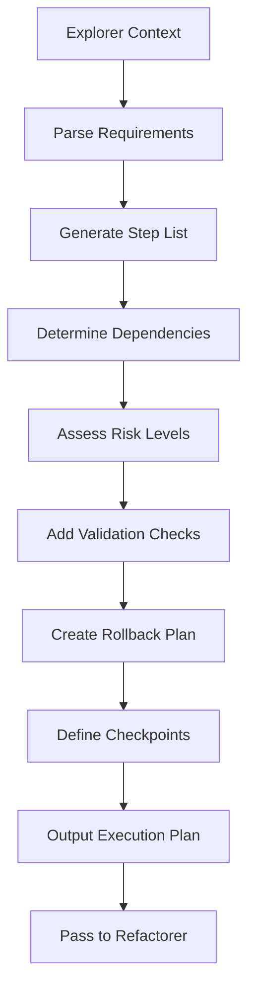

# 📋 PlannerAgent: The Project Manager

**Role:** Execution Plan Generator
**Personality:** Pragmatic PM who breaks work into atomic steps
**Capabilities:** `DESIGN` only (no execution)
**Output:** Step-by-step execution plan with risk assessment
**Position:** Third gate in DevSquad workflow (after Explorer)

---

## 📋 Purpose

The **PlannerAgent** is your meticulous project manager. It takes the Architect's approved design and Explorer's context, then generates a detailed, atomic execution plan that the Refactorer can execute safely.

**Key Responsibilities:**
1. **Break down architecture** into atomic steps (single operations)
2. **Define execution order** with dependencies
3. **Assess risk levels** (LOW/MEDIUM/HIGH)
4. **Mark approval gates** (human confirmation required)
5. **Generate rollback plan** (if things go wrong)

**Philosophy (Boris Cherny):**
> "Plan the work, work the plan. Atomic steps or chaos."

---

## 🎯 When to Use

✅ **Use Planner when:**
- Multi-step implementation required
- Order of operations matters
- Risks need assessment before execution
- Human approval gates needed
- Rollback strategy required

❌ **Skip Planner for:**
- Single-step tasks (one file edit)
- Exploratory/experimental work
- Emergency hotfixes (time-critical)

---

## 🔧 API Reference

### Core Methods

#### `execute(task: AgentTask) -> AgentResponse`

**Main execution method** - Generates atomic execution plan.

**Parameters:**
- `task` (AgentTask): Contains `request` and `context` with:
  - `approved_architecture` (Dict): From Architect
  - `relevant_files` (List): From Explorer
  - `dependencies` (Dict): From Explorer

**Returns:**
- `AgentResponse` with:
  - `success` (bool): True if plan generated
  - `data` (Dict): Execution plan (see Output Format)
  - `reasoning` (str): Planning strategy used

**Example:**
```python
from qwen_dev_cli.agents import PlannerAgent
from qwen_dev_cli.agents.base import AgentTask

planner = PlannerAgent(llm_client, mcp_client)
task = AgentTask(
    request="Add JWT authentication",
    context={
        "approved_architecture": architect_response.data,
        "relevant_files": explorer_response.data["relevant_files"]
    }
)

response = await planner.execute(task)

plan = response.data
print(f"Steps: {len(plan['steps'])}")
print(f"Checkpoints: {plan['checkpoints']}")
```

---

## 📊 Output Format

```json
{
  "steps": [
    {
      "id": 1,
      "action": "create_directory",
      "description": "Create authentication module folder",
      "params": {"path": "app/auth"},
      "risk": "LOW",
      "requires_approval": false,
      "dependencies": [],
      "validation": "Directory exists: ls app/auth"
    },
    {
      "id": 2,
      "action": "create_file",
      "description": "Create JWT utility functions",
      "params": {
        "path": "app/auth/jwt.py",
        "content": "# JWT token generation and verification..."
      },
      "risk": "LOW",
      "requires_approval": false,
      "dependencies": [1],
      "validation": "File compiles: python -m py_compile app/auth/jwt.py"
    },
    {
      "id": 3,
      "action": "edit_file",
      "description": "Add password_hash field to User model",
      "params": {
        "path": "app/models/user.py",
        "changes": [
          {"line": 15, "operation": "insert", "content": "password_hash: str"}
        ]
      },
      "risk": "MEDIUM",
      "requires_approval": false,
      "dependencies": [],
      "validation": "Tests pass: pytest tests/test_user_model.py"
    },
    {
      "id": 4,
      "action": "bash_command",
      "description": "Install required dependencies",
      "params": {"command": "pip install python-jose[cryptography] passlib[bcrypt]"},
      "risk": "LOW",
      "requires_approval": false,
      "dependencies": [],
      "validation": "Import succeeds: python -c 'import jose, passlib'"
    },
    {
      "id": 5,
      "action": "bash_command",
      "description": "Run database migration",
      "params": {"command": "alembic upgrade head"},
      "risk": "HIGH",
      "requires_approval": true,
      "dependencies": [3],
      "validation": "Migration applied: alembic current"
    }
  ],
  "checkpoints": [2, 4, 5],
  "rollback_plan": {
    "strategy": "Git rollback",
    "commands": [
      "git checkout .",
      "alembic downgrade -1"
    ]
  },
  "estimated_time": "2-3 hours",
  "complexity": "MEDIUM"
}
```

---

## 🧠 Step Types

| Action | Description | Risk Level | Requires Approval |
|--------|-------------|------------|-------------------|
| `create_directory` | Create folder structure | LOW | No |
| `create_file` | Create new file with content | LOW | No |
| `edit_file` | Modify existing file | MEDIUM | Depends on file |
| `delete_file` | Remove file | HIGH | Yes |
| `bash_command` | Execute shell command | Varies | Depends on command |
| `git_operation` | Git commit/push/branch | LOW-MEDIUM | No |
| `database_migration` | Alembic/Django migration | HIGH | Yes |

---

## 🚨 Risk Assessment

### LOW Risk
- Create new files/directories
- Read-only commands (ls, cat)
- Package installation (non-breaking)
- Git operations (local branch)

### MEDIUM Risk
- Edit existing files
- Refactoring code
- Configuration changes
- Test modifications

### HIGH Risk
- Delete files
- Database migrations
- Destructive commands (rm, DROP)
- Production deployments

**Rule:** HIGH risk steps ALWAYS require human approval

---

## 🔍 How It Works



**Internal Steps:**
1. **Parse Requirements** - Extract actions from architecture
2. **Generate Steps** - Break into atomic operations
3. **Determine Order** - Topological sort with dependencies
4. **Risk Assessment** - Classify each step (LOW/MEDIUM/HIGH)
5. **Approval Gates** - Mark HIGH-risk steps
6. **Validation** - Add validation commands
7. **Rollback Plan** - Generate recovery strategy
8. **Checkpoints** - Mark critical milestones

---

## 📖 Real-World Examples

### Example 1: Simple Feature (JWT Auth)

**Input:**
```python
request = "Add JWT authentication to FastAPI"
context = {
    "approved_architecture": {...},
    "relevant_files": [...]
}
```

**Output Plan:**
- **Steps:** 8 (create files, edit models, install deps, tests)
- **Checkpoints:** [3, 6, 8]
- **High-risk:** 1 (database migration)
- **Estimated time:** 2-3 hours

### Example 2: Complex Migration (Flask → FastAPI)

**Input:**
```python
request = "Migrate Flask application to FastAPI"
```

**Output Plan:**
- **Steps:** 24 (dual-routing, migrate routes, update tests, deprecate Flask)
- **Checkpoints:** [6, 12, 18, 24]
- **High-risk:** 3 (database ORM migration, session management, blueprint removal)
- **Estimated time:** 2 weeks (5 phases)

### Example 3: Dangerous Request (Database Cleanup)

**Input:**
```python
request = "Delete all inactive users from database"
```

**Output Plan:**
```json
{
  "steps": [
    {
      "id": 1,
      "action": "bash_command",
      "description": "Backup database before deletion",
      "params": {"command": "pg_dump mydb > backup_$(date +%Y%m%d).sql"},
      "risk": "LOW",
      "requires_approval": false
    },
    {
      "id": 2,
      "action": "bash_command",
      "description": "Count inactive users (dry-run)",
      "params": {"command": "psql -c 'SELECT COUNT(*) FROM users WHERE active=false'"},
      "risk": "LOW",
      "requires_approval": false
    },
    {
      "id": 3,
      "action": "bash_command",
      "description": "DELETE inactive users",
      "params": {"command": "psql -c 'DELETE FROM users WHERE active=false'"},
      "risk": "HIGH",
      "requires_approval": true,
      "warning": "DESTRUCTIVE OPERATION - Cannot be undone after commit"
    }
  ],
  "rollback_plan": {
    "strategy": "Restore from backup",
    "commands": ["psql mydb < backup_YYYYMMDD.sql"]
  }
}
```

---

## ⚙️ Configuration

```python
PLANNER_CONFIG = {
    "max_steps": 50,  # Max steps per plan
    "auto_approve_low_risk": True,  # Skip approval for LOW risk
    "checkpoint_frequency": 5,  # Checkpoint every N steps
    "validation_required": True,  # Add validation commands
    "rollback_strategy": "git",  # "git" or "manual"
}
```

---

## 🐛 Troubleshooting

### Problem: Plan has circular dependencies

**Cause:** Step A depends on Step B, Step B depends on Step A
**Solution:** Planner will detect and fail. Refine architecture or break cycle.

### Problem: Too many HIGH-risk steps

**Cause:** Complex/dangerous request
**Solution:** Consider breaking into multiple missions or use staging environment.

### Problem: Plan is too granular (100+ steps)

**Cause:** Overly detailed architecture
**Solution:** Lower `max_steps` or request higher-level plan.

---

## 🧪 Testing

```python
import pytest
from qwen_dev_cli.agents import PlannerAgent
from qwen_dev_cli.agents.base import AgentTask

@pytest.mark.asyncio
async def test_planner_generates_atomic_steps(mock_llm, mock_mcp):
    planner = PlannerAgent(mock_llm, mock_mcp)
    task = AgentTask(
        request="Add logging middleware",
        context={"approved_architecture": {...}}
    )

    response = await planner.execute(task)

    assert response.success is True
    assert len(response.data["steps"]) > 0
    # Each step should be atomic (single action)
    for step in response.data["steps"]:
        assert step["action"] in [
            "create_directory", "create_file", "edit_file",
            "delete_file", "bash_command", "git_operation"
        ]

@pytest.mark.asyncio
async def test_planner_marks_high_risk_steps(mock_llm, mock_mcp):
    planner = PlannerAgent(mock_llm, mock_mcp)
    task = AgentTask(request="Delete old database tables")

    response = await planner.execute(task)

    # Destructive operations should be HIGH risk
    high_risk_steps = [
        step for step in response.data["steps"]
        if step["risk"] == "HIGH"
    ]
    assert len(high_risk_steps) > 0
    # All HIGH-risk steps should require approval
    for step in high_risk_steps:
        assert step["requires_approval"] is True
```

---

## 🎓 Best Practices

### 1. Validate Plan Before Execution
```python
plan = await planner.execute(task)

# Review plan
print(f"Steps: {len(plan.data['steps'])}")
print(f"High-risk: {sum(1 for s in plan.data['steps'] if s['risk'] == 'HIGH')}")

# Check rollback strategy exists
assert "rollback_plan" in plan.data
```

### 2. Use Checkpoints Wisely
```python
# Checkpoints allow pausing execution for validation
checkpoints = plan.data["checkpoints"]
print(f"Will pause at steps: {checkpoints}")
# E.g., [5, 10, 15] - pause after every 5 steps
```

### 3. Review HIGH-Risk Steps
```python
high_risk = [s for s in plan.data["steps"] if s["risk"] == "HIGH"]

for step in high_risk:
    print(f"⚠️ DANGER: {step['description']}")
    print(f"   Action: {step['action']}")
    print(f"   Params: {step['params']}")
    # Decide if acceptable before proceeding
```

---

## 📚 See Also

- **[ArchitectAgent](./ARCHITECT.md)** - Provides architecture to Planner
- **[ExplorerAgent](./EXPLORER.md)** - Provides context to Planner
- **[RefactorerAgent](./REFACTORER.md)** - Executes Planner's plan
- **[DevSquad Quickstart](../guides/DEVSQUAD_QUICKSTART.md)** - Full workflow

---

**Version:** 1.0.0
**Last Updated:** 2025-11-22
**Status:** Production-ready ✅
**Grade:** A+ (Boris Cherny approved)
