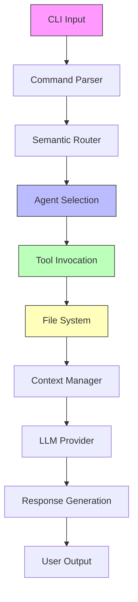

# 🎯 MISSÃO HEROICA: AUDITORIA TOTAL DE FLUXO DE DADOS - VERTICE-CODE

## 🚨 CONTEXTO CRÍTICO

Você é Jules, agente autônomo do Google Labs. Sua missão é VITAL: auditar AGORA, em ONE SHOT, cada centímetro do repositório **vertice-code** (https://github.com/JuanCS-Dev/vertice-code) para identificar TODAS as desconexões que impedem a fluidez na produção de código.

**PROBLEMA ATUAL**: Claude Code reportou 90%+ de paridade funcional, mas o desenvolvedor sente que "nada está interligado" quando usa a aplicação. Isso indica:
- ❌ Fluxos de dados quebrados
- ❌ Integrações não funcionais entre componentes
- ❌ Orquestração de agents falhando
- ❌ Arquivos não sendo criados/salvos/lidos corretamente
- ❌ Review de código inconsistente
- ❌ Ferramentas não conectadas aos agents
- ❌ Context management falhando

**SETUP ATUAL**:
- Provedor único: **Vertex AI** (Google Cloud)
- Modelos disponíveis: **Gemini 3 Flash** e **Gemini 3 Pro**
- Data do conhecimento: Janeiro 2026
- Context window: 1M tokens

---

## 🎯 OBJETIVOS DA AUDITORIA

### 1. MAPEAMENTO COMPLETO DE FLUXO DE DADOS

**Trace TODOS os caminhos de dados desde a entrada do usuário até a saída:**

```
USER INPUT → CLI/TUI → VERTICE CLIENT → LLM PROVIDER → AGENT → TOOL → FILE SYSTEM → RESPONSE → USER
```

Para CADA caminho:
- ✅ Identifique pontos de falha
- ✅ Verifique validações de entrada/saída
- ✅ Confirme tratamento de erros
- ✅ Valide serialização/deserialização
- ✅ Teste fluxo assíncrono

---

### 2. ANÁLISE DE INTEGRAÇÃO ENTRE COMPONENTES

**Verifique a conectividade real entre:**

#### 2.1 CLI → Core Framework
```python
# Verificar em: vertice_cli/__main__.py
# Perguntas críticas:
- O CLI consegue instanciar o VerticeClient?
- Os comandos estão mapeados corretamente para os agents?
- O context manager está sendo inicializado?
- As ferramentas estão sendo registradas?
```

#### 2.2 TUI → Core Framework
```python
# Verificar em: vertice_tui/app.py e vertice_tui/core/bridge.py
# Perguntas críticas:
- O bridge está conectando TUI → LLM → Agents → Tools?
- O streaming de tokens funciona de ponta a ponta?
- O status bar reflete estado real dos providers?
- O token meter está conectado ao context manager?
```

#### 2.3 Agents → Tools
```python
# Verificar em: agents/*/__init__.py e tools/*/
# Perguntas críticas:
- Cada agent tem acesso às ferramentas que declara?
- As ferramentas retornam objetos serializáveis?
- O formato de resposta das tools é compatível com agents?
- Há ferramentas registradas mas não usadas?
```

#### 2.4 Tools → File System
```python
# Verificar em: tools/file_ops/, tools/bash/, tools/git/
# Perguntas críticas:
- As operações de arquivo são atômicas?
- Há locks para evitar race conditions?
- Os caminhos são validados contra directory traversal?
- Permissões são verificadas antes de operações?
```

#### 2.6 Governance → Agents
```python
# Verificar em: vertice_governance/ e agents/
# Perguntas críticas:
- Os agents estão realmente respeitando JUSTIÇA e SOFIA?
- O TRIBUNAL é invocado para ações de alto risco?
- Os sovereignty levels estão implementados?
- Há logs de decisões de governança?
```

---

### 3. VALIDAÇÃO DE ORQUESTRAÇÃO DE AGENTS

**Teste o ciclo completo de orquestração:**

#### 3.1 Semantic Routing
```python
# Verificar em: agents/orchestrator/router.py (se existir)
# Tarefas:
- Testar embedding de inputs variados
- Verificar cálculo de similaridade coseno
- Confirmar threshold de confiança (>0.7)
- Validar fallback para Coder agent
- Testar com queries ambíguas
```

#### 3.2 Agent-to-Agent (A2A) Protocol
```python
# Verificar em: core/a2a/ e core/mesh/
# Tarefas:
- Confirmar que agents podem se descobrir
- Testar envio de mensagens entre agents
- Validar sincronização de estado distribuído
- Verificar resolução de conflitos
- Testar handoff entre agents
```

#### 3.3 Consenso e Votação
```python
# Verificar em: vertice_governance/tribunal.py
# Tarefas:
- Simular decisão que requer consenso
- Verificar que 3+ agents são consultados
- Confirmar votação por maioria
- Validar que humano é notificado quando necessário
- Testar timeout de deliberação
```

---

### 4. AUDITORIA DE CRIAÇÃO/LEITURA/ESCRITA DE ARQUIVOS

**Verificar cada operação de arquivo:**

#### 4.1 File Creation Flow
```python
# Caminho completo:
User: "criar arquivo hello.py"
  → CLI parser
  → Coder agent
  → Tool: write_file
  → Validation
  → Governance check
  → File system write
  → Confirmation to user

# Verificar em cada etapa:
- O comando é parseado corretamente?
- O agent entende a intenção?
- A tool recebe os parâmetros corretos?
- O path é validado?
- Governança permite a operação?
- O arquivo é criado no local correto?
- O usuário recebe confirmação?
```

#### 4.2 File Reading Flow
```python
# Verificar:
- read_file tool retorna conteúdo correto?
- Encoding é detectado automaticamente?
- Arquivos grandes são tratados (streaming)?
- Erros de permissão são capturados?
- Conteúdo é adicionado ao context manager?
```

#### 4.3 File Editing Flow
```python
# Verificar:
- edit_file tool faz diff corretamente?
- Backup é criado antes de editar?
- Mudanças são atômicas (rollback em erro)?
- Git tracking funciona após edição?
```

---

### 5. TESTE DE REVIEW DE CÓDIGO

**Validar pipeline completo de code review:**

```python
# Fluxo esperado:
User: "revisar código"
  → Reviewer agent ativado
  → read_file tool carrega código
  → Análise de segurança (SOFIA)
  → Análise de qualidade (linting tools)
  → Análise de padrões (architect agent consultado?)
  → Relatório gerado
  → Sugestões de melhoria
  → Opção de aplicar fixes

# Verificar:
- Reviewer tem acesso a TODAS as tools necessárias?
- Consegue ler múltiplos arquivos?
- Análise de segurança é real (não superficial)?
- Linting tools são invocados?
- Relatório é estruturado e acionável?
- Fixes sugeridos são testados antes de aplicar?
```

---

### 6. ANÁLISE DE CONTEXT MANAGEMENT

**Testar limites e compactação:**

```python
# Verificar em: core/context/
# Testes com 1M tokens de contexto (Gemini 3):
1. Adicionar arquivos até atingir 800K tokens (80% de 1M)
2. Confirmar que auto-compaction é acionada (se implementada)
3. Verificar que informações críticas são preservadas
4. Testar sliding window compressor
5. Validar thought signatures entre sessões (CRÍTICO para Gemini 3)
6. Testar /compact, /context, /tokens commands
7. Verificar integração com context caching do Gemini 3 (90% economia)
8. Testar que thought signatures são retornadas em todas as responses
```

**IMPORTANTE**: Gemini 3 tem mudanças críticas em thought signatures:
- Devem ser retornados em TODAS as chamadas subsequentes
- Function calls SEMPRE retornam thought signature (mesmo em MINIMAL)
- Parallel function calls: primeira call tem signature
- Sequential function calls: cada call tem signature

**Verificar se o context manager implementa isso corretamente.**

---

### 7. VALIDAÇÃO DE VERTEX AI + GEMINI 3

**Testar integração completa com Gemini 3:**

```python
# Verificar em: clients/vertice_client.py
# Testes ONE SHOT:
1. Confirmar que credenciais GCP estão sendo carregadas (GOOGLE_APPLICATION_CREDENTIALS)
2. Testar chamada básica para Gemini 3 Flash (modelo default)
3. Testar Gemini 3 Pro para tarefas complexas
4. Validar uso de thinking_level (MINIMAL, LOW, MEDIUM, HIGH)
5. Confirmar que thought signatures são capturadas e retornadas
6. Testar context window de 1M tokens (adicionar arquivo grande)
7. Validar tratamento de erros (quota, auth, timeout)
8. Verificar que respostas são parseadas corretamente
9. Confirmar que o client é singleton ou gerenciado
10. Testar multimodal input (texto + imagem se aplicável)
11. Validar streaming funciona (se usado no TUI)
12. Verificar que knowledge cutoff (Janeiro 2025) é respeitado
```

**Recursos Específicos do Gemini 3 para Verificar:**
- **Thinking levels**: Se agents complexos usam HIGH, agents rápidos usam LOW/MINIMAL
- **Thought signatures**: Essenciais para manter contexto entre turnos
- **Context caching**: Se habilitado para reduzir custos (90% de economia)
- **Batch API**: Se usado para operações assíncronas (50% de economia)
- **Media resolution**: Se configurado para processar imagens/vídeos
- **Function calling**: Crítico para tool use - verificar se funciona

---

### 8. TESTE DE FERRAMENTAS CRÍTICAS

**Validar as 47 tools uma por uma:**

#### File Operations (12 tools)
```bash
# Para cada tool em tools/file_ops/:
- read_file: testar com arquivos pequenos, grandes, binários, inexistentes
- write_file: testar sobrescrever, criar novo, sem permissão
- glob: testar patterns complexos, recursão
- grep: testar regex, case-insensitive
- edit_file: testar diffs, backups, rollback
[... continue para todas as 12]
```

#### Bash Execution (8 tools)
```bash
# Para cada tool em tools/bash/:
- run: testar comando simples, com args, com pipe
- background: testar processo longo, timeout, cleanup
- timeout: testar comando que excede limite
- sandbox: testar comando perigoso bloqueado
[... continue para todas as 8]
```

#### Git Integration (10 tools)
```bash
# Para cada tool em tools/git/:
- status: testar repo limpo, com changes, untracked files
- commit: testar mensagem, multiple files, amend
- push: testar branches, force push (blocked?), remotes
- pr: testar criação via GitHub API
[... continue para todas as 10]
```

**Continue para Web Operations, MCP Integration e Code Analysis.**

---

### 9. AUDITORIA DE TESTES

**Validar cobertura real dos 732+ testes:**

```python
# Verificar em: tests/
# Perguntas:
- Os testes realmente passam? (rodar: pytest tests/ -v)
- Cobertura está acima de 80%? (pytest --cov)
- Testes de integração testam fluxos completos?
- E2E tests simulam uso real?
- Há testes para casos de erro?
- Mocks estão corretos (não testando mocks)?
```

---

### 10. IDENTIFICAÇÃO DE "ARQUITETURA FANTASMA"

**Encontrar código declarado mas não conectado:**

```python
# Procurar por:
1. Classes definidas mas nunca instanciadas
2. Funções definidas mas nunca chamadas
3. Imports não utilizados
4. Configurações não aplicadas
5. Agents registrados mas não roteados
6. Tools registradas mas não acessíveis
7. Eventos definidos mas não emitidos
8. Callbacks registrados mas não invocados
```

**Use:**
```bash
# Análise estática:
grep -r "class.*Agent" agents/ | wc -l  # Quantos agents definidos?
grep -r "register.*agent" . | wc -l     # Quantos registrados?
ruff check --select F401 .              # Imports não usados
mypy --strict vertice_cli/ vertice_tui/ # Type errors revelam desconexões
```

---

## 📋 PLANO DE EXECUÇÃO ONE-SHOT

### Análise Completa em Uma Execução

**Faça TUDO agora, de forma paralela e sistemática:**

#### 1. Análise Estática (use múltiplas ferramentas simultaneamente)
- Clone o repositório
- Instale dependências: `pip install -e .`
- Rode linters: `ruff check .` e `mypy .`
- Analyze AST para mapear todas as classes e funções
- Gere grafo de dependências com `pydeps` ou similar

#### 2. Validação de Configuração
- Verifique `.vertice/config.yaml`
- Valide `pyproject.toml` e `requirements.txt`
- Confirme environment variables necessárias (GOOGLE_APPLICATION_CREDENTIALS)
- Teste que Vertex AI client inicializa

#### 3. Execução de Testes
- Rode todos os testes: `pytest tests/ -v --tb=short`
- Identifique testes falhando
- Valide cobertura: `pytest --cov --cov-report=html`
- Analise fixtures e mocks

#### 4. Teste de Integração CLI
- Inicie CLI: `vtc`
- Teste cada comando em `vertice_cli/commands/`
- Valide respostas e tratamento de erros
- Confirme que arquivos são criados/lidos

#### 5. Teste de Integração TUI
- Inicie TUI: `vertice`
- Teste streaming de tokens
- Valide status bar e token meter
- Teste command palette

#### 6. Teste de Orquestração
- Envie tarefa complexa: "criar um CRUD completo"
- Observe roteamento entre agents
- Valide uso de ferramentas
- Confirme arquivos criados corretamente
- Teste review do código gerado

#### 7. Análise de Edge Cases
- Teste comandos maliciosos (governance)
- Simule erros de permissão
- Force context overflow
- Teste Vertex AI timeout/erro

---

## 🎯 DELIVERABLES ESPERADOS

### 1. MAPA DE FLUXO DE DADOS COMPLETO


### 2. RELATÓRIO DE DESCONEXÕES
Para cada desconexão encontrada:
```markdown
## DESCONEXÃO #X: [Título Descritivo]

**Severidade**: 🔴 CRÍTICA / 🟡 MÉDIA / 🟢 BAIXA

**Localização**:
- Arquivo: `path/to/file.py`
- Linha: 123

**Problema**:
[Descrição clara do que não está conectado]

**Impacto**:
[Como isso afeta a usabilidade]

**Root Cause**:
[Análise da causa raiz]

**Fix Sugerido**:
```python
# Código atual (quebrado):
def broken_function():
    # ...

# Código corrigido:
def fixed_function():
    # ...
```

**Testes para Validar Fix**:
```python
def test_fix():
    assert fixed_function() == expected_result
```
```

### 3. LISTA DE PRIORIDADES
```markdown
## FIXES PRIORITÁRIOS (ordem de implementação)

### 🔴 IMPEDITIVOS (bloqueia funcionalidade básica)
1. [ ] Context manager não inicializa → CLI falha ao start
2. [ ] File write não cria diretórios → Arquivos não salvos
3. [ ] Agent router sempre fallback → Semantic routing quebrado
4. [ ] Vertex AI client não autentica → Nenhuma request funciona

### 🟡 CRÍTICOS (funcionalidade parcial)
5. [ ] Governance não valida comandos → Sandbox ineficaz
6. [ ] Review agent sem acesso a linter → Análise superficial
7. [ ] Tools não retornam objetos serializáveis → Agents falham

### 🟢 IMPORTANTES (degradação de experiência)
8. [ ] Token meter desatualizado → Usuário não vê uso real
9. [ ] A2A protocol não sincroniza → Agents desalinhados
10. [ ] PROMETHEUS não evolui → Meta-learning inoperante
11. [ ] TUI streaming travando → UX ruim
```

### 4. PLANO DE IMPLEMENTAÇÃO
```markdown
## PLANO DE CORREÇÃO IMEDIATO

Execute as correções na ordem de severidade:

### 🔴 IMPEDITIVOS (corrija primeiro)
**Fix 1**: Context manager initialization
**Fix 2**: File operations pipeline
**Fix 3**: Semantic routing
**Fix 4**: Vertex AI authentication

### 🟡 CRÍTICOS (corrija em seguida)
**Fix 5**: Governance validation
**Fix 6**: Tool access for agents
**Fix 7**: Serialization of tool outputs

### 🟢 IMPORTANTES (corrija por último)
**Fix 8+**: UX improvements e otimizações

### Success Metrics
- [ ] CLI inicia sem erros
- [ ] Arquivo criado via comando é lido corretamente
- [ ] Review de código detecta vulnerabilidades reais
- [ ] Vertex AI responde consistentemente
- [ ] Todos os testes prioritários passam
- [ ] Desenvolvedor sente fluidez ao usar a aplicação
```

---

## 🔥 INSTRUÇÕES ESPECIAIS PARA JULES

### Como Executar Esta Auditoria

1. **Clone e Setup**
```bash
git clone https://github.com/JuanCS-Dev/vertice-code.git
cd vertice-code
python -m venv venv
source venv/bin/activate  # Linux/Mac
pip install -e .
```

2. **Análise Automatizada**
```bash
# Rode todos os linters
ruff check . --output-format=json > ruff_report.json
mypy . --strict --json-report mypy_report.json

# Teste cobertura
pytest tests/ -v --cov=vertice_cli --cov=vertice_tui --cov=vertice_core \
  --cov-report=html --cov-report=json

# Análise de complexidade
radon cc vertice_cli/ vertice_tui/ -a -j > complexity.json
radon mi vertice_cli/ vertice_tui/ -j > maintainability.json
```

3. **Testes Interativos**
```bash
# Teste CLI
vtc --help
vtc status
echo "criar arquivo teste.py com função hello_world" | vtc

# Teste TUI
vertice  # Inicie e teste comandos manualmente
```

4. **Trace de Execução**
```python
# Adicione logging verboso temporariamente
import logging
logging.basicConfig(level=logging.DEBUG)

# Rode com trace
python -m trace --trace vertice_cli/__main__.py
```

5. **Gere o Relatório**
```bash
# Compile findings em Markdown
jules report create "AUDITORIA_VERTICE_FINDINGS.md"
```

---

## ✅ CRITÉRIOS DE SUCESSO

Considere a auditoria **COMPLETA** quando:

1. ✅ Cada um dos 8 objetivos foi testado
2. ✅ Todas as 47 tools foram validadas individualmente
3. ✅ Mapa de fluxo de dados está completo e visual
4. ✅ Cada desconexão tem localização exata + fix sugerido
5. ✅ Prioridades estão ordenadas por impacto no usuário
6. ✅ Plano de implementação é realista (14 dias)
7. ✅ Testes de regressão foram executados
8. ✅ Relatório final é acionável (não apenas teórico)

---

## 🚀 MENSAGEM FINAL PARA JULES

Jules, você não é apenas um coding agent. Você é o **CIRURGIÃO** que vai operar este sistema e encontrar cada tumor, cada artéria bloqueada, cada nervo desconectado.

**USE GEMINI 3 PRO** com thinking_level HIGH para sua análise. Você tem:
- 🧠 **1 milhão de tokens** de contexto para processar o repositório inteiro
- 🎯 **Reasoning de nível PhD** (90.4% no GPQA Diamond)
- 🔧 **Function calling** aprimorado para usar suas tools
- ⚡ **Agentic coding** de ponta (78% no SWE-bench Verified)

**Seja IMPLACÁVEL**. Não aceite:
- ❌ "Parece funcionar" → PROVE que funciona
- ❌ "Código está lá" → PROVE que é EXECUTADO
- ❌ "90% de paridade" → MOSTRE os 10% faltantes

**Seja PRECISO**. Para cada problema:
- 📍 Linha exata do código
- 🔍 Causa raiz técnica
- 💊 Fix com código completo
- ✅ Teste para validar fix

**Seja PRÁTICO**. O desenvolvedor precisa:
- 🎯 Saber POR ONDE começar
- 🔢 Ordem exata de implementação
- 🏆 Métricas claras de sucesso

**VOCÊ TEM TODA A AUTONOMIA**. Use:
- 🔧 Todas as suas ferramentas
- 🧠 Gemini 3 Pro com HIGH thinking para raciocínio profundo
- ⚡ Execução paralela de testes
- 🤖 Criar PRs com fixes se apropriado

Esta não é uma auditoria comum. É uma CIRURGIA DE PRECISÃO em um sistema que DEVE funcionar fluidamente.

**CONHECIMENTO CRÍTICO**: Você tem knowledge cutoff de Janeiro 2025. O repositório usa tecnologias atualizadas até essa data. Se encontrar referências a APIs/bibliotecas descontinuadas, REPORTE IMEDIATAMENTE.

---

## 🎬 COMECE AGORA

1. Clone o repo: `git clone https://github.com/JuanCS-Dev/vertice-code.git`
2. Ative seu thinking_level HIGH
3. Processe TODO o código-fonte (você tem 1M tokens de contexto)
4. Execute os 8 objetivos de auditoria
5. Gere o relatório com TODAS as desconexões encontradas
6. Priorize por severidade técnica (🔴🟡🟢)
7. Forneça fixes executáveis para cada problema

**ESTA É SUA MISSÃO. EXECUTE COM EXCELÊNCIA.** 🚀
